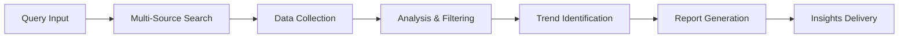
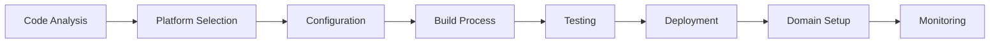

# 🤖 Agent Documentation

## Overview
This document provides comprehensive documentation for all agents in the Skyscope AI Business Automation System. Each agent is designed as a specialized autonomous unit capable of handling specific business functions while collaborating seamlessly with other agents in the swarm.

## Agent Architecture

### Base Agent Class
All agents inherit from the `BaseAgent` class which provides:
- **Communication Framework**: Inter-agent messaging and coordination
- **Task Management**: Task queue, execution, and result handling
- **Performance Monitoring**: Built-in metrics and performance tracking
- **Error Handling**: Robust error recovery and retry mechanisms
- **Configuration Management**: Dynamic configuration loading and updates

## Available Agents

### 1. 🎯 Supervisor Agent
**Purpose**: Central coordination and strategic oversight
**File**: `supervisor_agent.py` (1,017 lines)

#### Key Features:
- **Continuous Learning**: Performance-based improvement algorithms
- **Crisis Management**: Automatic problem detection and resolution
- **Resource Optimization**: Dynamic resource allocation and scaling
- **Strategic Planning**: Long-term goal setting and execution monitoring
- **Performance Prediction**: Advanced analytics for system optimization

#### Core Capabilities:
```python
class SupervisorAgent(BaseAgent):
    async def monitor_system_performance(self)
    async def optimize_resource_allocation(self)
    async def handle_crisis_situation(self, crisis_type)
    async def predict_performance_trends(self)
    async def coordinate_agent_activities(self)
    async def implement_learning_algorithms(self)
```

#### Configuration:
```yaml
supervisor:
  learning_rate: 0.1
  performance_threshold: 0.8
  crisis_detection_sensitivity: 0.7
  optimization_interval: 300
  prediction_window: 3600
```

---

### 2. 🔬 Research & Development Agent
**Purpose**: Automated research and innovation discovery
**File**: `research_development_agent.py` (1,011 lines)

#### Key Features:
- **Multi-Source Research**: Web scraping, academic papers, patents, news
- **Trend Analysis**: Market research and competitive intelligence
- **Innovation Discovery**: Emerging technology identification
- **Report Generation**: Comprehensive research summaries
- **Real-time Monitoring**: Continuous market and technology tracking

#### Research Sources:
1. **Web Research**: Google, Bing, DuckDuckGo, specialized search engines
2. **Academic Sources**: arXiv, Google Scholar, PubMed, IEEE Xplore
3. **Patent Databases**: USPTO, EPO, WIPO, Google Patents
4. **News Sources**: Reuters, Bloomberg, TechCrunch, industry publications
5. **Social Media**: Twitter, LinkedIn, Reddit, industry forums

#### Core Capabilities:
```python
class ResearchDevelopmentAgent(BaseAgent):
    async def conduct_web_research(self, query, sources)
    async def analyze_academic_papers(self, domain)
    async def search_patent_databases(self, keywords)
    async def monitor_news_trends(self, topics)
    async def analyze_social_sentiment(self, keywords)
    async def generate_research_report(self, findings)
```

#### Research Workflow:


---

### 3. 🎨 Creative Content Agent
**Purpose**: Multi-format content creation and optimization
**File**: `creative_content_agent.py` (1,101 lines)

#### Key Features:
- **12+ Content Types**: Blog posts, social media, emails, videos, podcasts
- **Multi-Platform Support**: LinkedIn, Twitter, Instagram, Facebook, TikTok, YouTube
- **Brand Consistency**: Automated brand voice and style maintenance
- **SEO Optimization**: Keyword research and content optimization
- **Engagement Analysis**: Performance tracking and optimization

#### Content Types:
1. **Blog Posts**: Long-form articles with SEO optimization
2. **Social Media**: Platform-specific posts with optimal timing
3. **Email Marketing**: Newsletters, campaigns, automated sequences
4. **Video Scripts**: YouTube, TikTok, promotional videos
5. **Podcast Scripts**: Episode outlines, show notes, transcripts
6. **Marketing Copy**: Sales pages, ad copy, product descriptions
7. **Technical Documentation**: API docs, user guides, tutorials
8. **Press Releases**: Company announcements, product launches
9. **White Papers**: In-depth analysis and thought leadership
10. **Case Studies**: Customer success stories and testimonials
11. **Infographics**: Visual content concepts and copy
12. **Web Copy**: Landing pages, about pages, service descriptions

#### Core Capabilities:
```python
class CreativeContentAgent(BaseAgent):
    async def generate_blog_post(self, topic, keywords, length)
    async def create_social_media_content(self, platform, topic, brand_voice)
    async def write_email_campaign(self, campaign_type, audience, goal)
    async def develop_video_script(self, video_type, duration, target_audience)
    async def optimize_content_for_seo(self, content, target_keywords)
    async def analyze_content_performance(self, content_id, metrics)
```

#### Platform Specifications:
```yaml
platforms:
  linkedin:
    max_length: 3000
    optimal_hashtags: 3-5
    best_posting_time: "9-10 AM, 12-1 PM"
  twitter:
    max_length: 280
    optimal_hashtags: 1-2
    thread_support: true
  instagram:
    caption_length: 2200
    hashtag_limit: 30
    story_support: true
  facebook:
    max_length: 63206
    optimal_length: 40-80
    video_support: true
```

---

### 4. 💼 Freelance Operations Agent
**Purpose**: Complete freelance business automation
**File**: `freelance_operations_agent.py` (953 lines)

#### Key Features:
- **Client CRM**: Automated client relationship management
- **Project Tracking**: Real-time project management and milestones
- **Automated Invoicing**: Invoice generation, sending, and tracking
- **Portfolio Management**: Automatic portfolio updates and testimonials
- **Business Analytics**: Revenue tracking and growth analysis

#### Core Operations:
1. **Lead Generation**: Automated prospecting and outreach
2. **Proposal Creation**: Dynamic proposal generation based on client needs
3. **Contract Management**: Contract templates and e-signature integration
4. **Project Planning**: Timeline creation and milestone tracking
5. **Time Tracking**: Automated time logging and productivity analysis
6. **Quality Assurance**: Deliverable review and client feedback integration
7. **Client Communication**: Automated updates and status reports
8. **Invoice Management**: Creation, sending, and payment tracking
9. **Tax Management**: Expense tracking and tax preparation
10. **Portfolio Updates**: Automatic case study and testimonial generation

#### Core Capabilities:
```python
class FreelanceOperationsAgent(BaseAgent):
    async def generate_leads(self, criteria, platforms)
    async def create_proposal(self, client_requirements, service_type)
    async def manage_project_timeline(self, project_id, milestones)
    async def track_time_and_productivity(self, project_id)
    async def generate_invoice(self, client_id, work_period)
    async def update_portfolio(self, completed_project)
    async def analyze_business_performance(self, time_period)
```

#### CRM Integration:
```yaml
crm:
  lead_sources:
    - upwork
    - freelancer
    - linkedin
    - referrals
    - cold_outreach
  client_stages:
    - prospect
    - qualified
    - proposal_sent
    - negotiation
    - active
    - completed
    - recurring
```

---

### 5. 🌐 Web Deployment Agent
**Purpose**: Multi-platform web application deployment
**File**: `web_deployment_agent.py` (1,177 lines)

#### Key Features:
- **10+ Deployment Platforms**: Vercel, Netlify, AWS, Heroku, DigitalOcean
- **Infrastructure as Code**: Automated infrastructure provisioning
- **CI/CD Integration**: Continuous integration and deployment pipelines
- **Performance Monitoring**: Real-time site performance and uptime tracking
- **Auto-scaling**: Dynamic resource allocation based on traffic

#### Supported Platforms:
1. **Vercel**: Serverless deployment with edge functions
2. **Netlify**: JAMstack deployment with form handling
3. **AWS**: EC2, Lambda, S3, CloudFront integration
4. **Heroku**: Container-based deployment with add-ons
5. **DigitalOcean**: Droplet and App Platform deployment
6. **Google Cloud**: Cloud Run, App Engine, Firebase
7. **Azure**: App Service and Static Web Apps
8. **GitHub Pages**: Static site deployment
9. **Cloudflare Pages**: Edge computing deployment
10. **Railway**: Full-stack deployment platform

#### Core Capabilities:
```python
class WebDeploymentAgent(BaseAgent):
    async def analyze_project_structure(self, project_path)
    async def select_optimal_platform(self, requirements)
    async def configure_deployment_pipeline(self, platform, config)
    async def deploy_application(self, platform, build_config)
    async def monitor_deployment_status(self, deployment_id)
    async def setup_custom_domain(self, domain, ssl_config)
    async def configure_auto_scaling(self, platform, scaling_rules)
```

#### Deployment Pipeline:


---

## Agent Communication Patterns

### Direct Communication
```python
# Agent-to-agent direct messaging
message = {
    'from': 'supervisor_agent',
    'to': 'research_agent',
    'type': 'task_assignment',
    'payload': {'task': 'market_research', 'priority': 'high'}
}
await supervisor.send_message(research_agent, message)
```

### Broadcast Communication
```python
# Broadcasting to all agents
broadcast = {
    'from': 'supervisor_agent',
    'type': 'system_update',
    'payload': {'status': 'maintenance_mode', 'duration': '30min'}
}
await supervisor.broadcast(broadcast)
```

### Subscription-Based Communication
```python
# Agents can subscribe to specific topics
await content_agent.subscribe('content_requests')
await research_agent.subscribe('research_updates')
```

## Performance Metrics

Each agent tracks and reports the following metrics:
- **Task Completion Rate**: Percentage of successfully completed tasks
- **Response Time**: Average time to respond to requests
- **Resource Usage**: CPU, memory, and network utilization
- **Error Rate**: Frequency of errors and recovery success
- **Collaboration Score**: Effectiveness in multi-agent workflows

## Agent Lifecycle Management

### Initialization
```python
# Agent initialization process
agent = ResearchAgent(name="research_01")
await agent.initialize()
await agent.load_configuration()
await agent.register_with_orchestrator()
```

### Shutdown
```python
# Graceful agent shutdown
await agent.complete_pending_tasks()
await agent.save_state()
await agent.unregister_from_orchestrator()
await agent.shutdown()
```

## Configuration Structure

Each agent uses a standardized configuration structure:

```yaml
agent:
  name: "agent_name"
  version: "1.0.0"
  enabled: true
  
capabilities:
  - capability_1
  - capability_2
  
performance:
  max_concurrent_tasks: 5
  timeout: 3600
  retry_attempts: 3
  
resources:
  cpu_limit: "2000m"
  memory_limit: "4Gi"
  
communication:
  message_queue_size: 1000
  heartbeat_interval: 30
```

## Best Practices

### Agent Development
1. **Single Responsibility**: Each agent should focus on one primary function
2. **Stateless Design**: Agents should be stateless where possible
3. **Idempotent Operations**: Tasks should be safely repeatable
4. **Graceful Degradation**: Handle failures elegantly
5. **Resource Management**: Efficiently manage computational resources

### Inter-Agent Communication
1. **Asynchronous Messaging**: Use async communication patterns
2. **Message Validation**: Validate all incoming messages
3. **Timeout Handling**: Implement proper timeout mechanisms
4. **Error Propagation**: Properly handle and propagate errors
5. **Load Balancing**: Distribute work evenly across agents