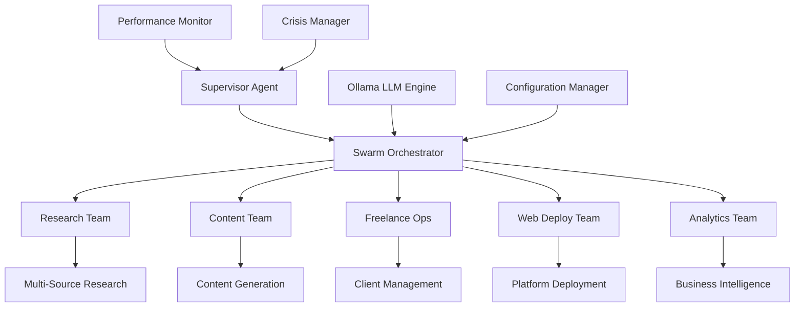

# 🚀 Skyscope AI Agent Business Automation System

## *Revolutionary Multi-Agent Swarm Framework for Autonomous Business Operations*


---

## 📖 **Overview**

The **Skyscope AI Agent Business Automation System** is a cutting-edge, production-ready multi-agent swarm framework designed to revolutionize business operations through autonomous AI agents. This system combines the latest advances in agentic business orchestration, multi-agent collaboration, and AI-driven enterprise automation to create a comprehensive solution for modern businesses.

### 🎯 **Mission Statement**
*"To democratize enterprise-level AI automation by providing businesses with autonomous, intelligent agents capable of running complex operations with minimal human oversight."*

---

## ✨ **Key Features**

### 🧠 **Advanced Multi-Agent Swarm Orchestration**
- **6 Orchestration Modes**: Hierarchical, Collaborative, Sequential, Parallel, Swarm Intelligence, and Consensus
- **Intelligent Agent Selection**: Dynamic agent assignment based on task requirements and performance
- **Load Balancing**: Automatic workload distribution across available agents
- **Fault Tolerance**: Self-healing system with automatic failover and recovery

### 🤖 **Ollama-Powered Local LLM Integration**
- **15+ Supported Models**: Llama2, CodeLlama, Mistral, Vicuna, Orca-Mini, and more
- **macOS Optimized**: Metal GPU acceleration for Apple Silicon (M1/M2/M3)
- **Privacy-First**: Complete local processing with no data leaving your system
- **Model Management**: Automatic model downloading, updating, and optimization

### 🎛️ **Intelligent Supervisor Agent**
- **Continuous Learning**: Performance-based agent improvement and optimization
- **Crisis Management**: Automatic detection and response to system issues
- **Resource Optimization**: Dynamic resource allocation and performance tuning
- **Strategic Planning**: Long-term goal setting and execution monitoring

### 🔬 **Automated Research & Development Teams**
- **Multi-Source Research**: Web scraping, academic papers, patents, news, social media
- **Trend Analysis**: Market research and competitive intelligence
- **Innovation Discovery**: Emerging technology and opportunity identification
- **Report Generation**: Comprehensive research reports and insights

### 🎨 **AI-Driven Creative Content Generation**
- **12+ Content Types**: Blog posts, social media, emails, marketing copy, videos, podcasts
- **Multi-Platform Support**: LinkedIn, Twitter, Instagram, Facebook, TikTok, YouTube
- **Brand Consistency**: Automated brand voice and style maintenance
- **Content Optimization**: SEO optimization and engagement analysis

### 💼 **Complete Freelance Operations Management**
- **Client CRM**: Automated client relationship management and communication
- **Project Tracking**: Real-time project management and milestone tracking
- **Automated Invoicing**: Invoice generation, sending, and payment tracking
- **Portfolio Management**: Automatic portfolio updates and client testimonials

### 🌐 **Multi-Platform Web Deployment Automation**
- **10+ Deployment Platforms**: Vercel, Netlify, AWS, Heroku, DigitalOcean, GCP, Azure
- **Infrastructure as Code**: Automated infrastructure provisioning and management
- **CI/CD Integration**: Continuous integration and deployment pipelines
- **Performance Monitoring**: Real-time site performance and uptime monitoring

### 📊 **Real-Time Analytics & Monitoring**
- **Performance Dashboards**: Comprehensive system and agent performance metrics
- **Predictive Analytics**: Performance prediction and trend analysis
- **Alert System**: Proactive notifications for critical system events
- **Business Intelligence**: Revenue tracking and business growth analytics

---

## 🏗️ **System Architecture**



### **Core Components:**

1. **🎯 Supervisor Agent** - Central intelligence and decision-making
2. **🔄 Swarm Orchestrator** - Multi-agent coordination and task distribution  
3. **🧠 Ollama Integration** - Local LLM processing and model management
4. **📊 Performance Monitor** - Real-time system analytics and optimization
5. **⚡ Crisis Manager** - Autonomous problem detection and resolution

---

## 🚀 **Quick Start Guide**

### **Prerequisites**
- macOS 11+ (Apple Silicon recommended)
- Python 3.8+
- 8GB+ RAM (16GB recommended for optimal performance)
- 20GB+ free disk space

### **1. Installation**

```bash
# Clone the repository
git clone https://github.com/skyscope-sentinel/Skyscope-AI-Agent-Run-Business.git
cd Skyscope-AI-Agent-Run-Business

# Run macOS setup (installs all dependencies including Ollama)
python setup_macos.py

# Activate virtual environment
source venv/bin/activate

# Install Python dependencies
pip install -r requirements.txt
```

### **2. Configuration**

```bash
# Copy configuration template
cp config/config_template.yaml config/config.yaml

# Edit configuration with your preferences
nano config/config.yaml
```

### **3. Launch System**

```bash
# Start the main application
python main_application.py

# Or launch the web interface
streamlit run app.py
```

### **4. Access Dashboard**
- **Web Interface**: http://localhost:8501
- **API Endpoint**: http://localhost:8000
- **Documentation**: http://localhost:8000/docs

---

## 🛠️ **Orchestration Modes**

### **1. 🏛️ Hierarchical Mode**
Traditional supervisor-worker pattern with clear command structure.
```python
orchestrator = SwarmOrchestrator(mode="HIERARCHICAL")
orchestrator.assign_supervisor(SupervisorAgent())
orchestrator.add_workers([research_agent, content_agent, deploy_agent])
```

### **2. 🤝 Collaborative Mode**  
Peer-to-peer coordination where agents work as equals.
```python
orchestrator = SwarmOrchestrator(mode="COLLABORATIVE")
orchestrator.enable_peer_communication()
orchestrator.set_consensus_threshold(0.7)
```

### **3. 📋 Sequential Mode**
Linear task execution with dependency management.
```python
orchestrator = SwarmOrchestrator(mode="SEQUENTIAL")
orchestrator.create_task_chain([research, content, review, deploy])
```

### **4. ⚡ Parallel Mode**
Concurrent task execution with intelligent load balancing.
```python
orchestrator = SwarmOrchestrator(mode="PARALLEL")
orchestrator.set_max_concurrent_tasks(8)
orchestrator.enable_load_balancing()
```

### **5. 🐜 Swarm Intelligence Mode**
Emergent behavior and collective decision making.
```python
orchestrator = SwarmOrchestrator(mode="SWARM_INTELLIGENCE")
orchestrator.enable_pheromone_trails()
orchestrator.set_exploration_rate(0.3)
```

### **6. 🗳️ Consensus Mode**
Democratic decision making with voting mechanisms.
```python
orchestrator = SwarmOrchestrator(mode="CONSENSUS")
orchestrator.set_voting_algorithm("weighted")
orchestrator.require_majority_consensus()
```

---

## 🎯 **Use Cases & Workflows**

### **📈 Business Automation Workflows**

#### **1. Complete Market Research Pipeline**
```python
# Automated market research with multi-source analysis
research_workflow = {
    'web_research': ['industry_trends', 'competitor_analysis'],
    'academic_research': ['latest_papers', 'research_insights'],
    'patent_research': ['innovation_landscape', 'ip_opportunities'],
    'social_listening': ['sentiment_analysis', 'consumer_insights'],
    'report_generation': ['executive_summary', 'detailed_findings']
}

orchestrator.execute_workflow('market_research', research_workflow)
```

#### **2. Content Marketing Campaign**
```python
# End-to-end content creation and distribution
content_campaign = {
    'research_phase': ['topic_research', 'keyword_analysis'],
    'creation_phase': ['blog_posts', 'social_content', 'email_series'],
    'optimization_phase': ['seo_optimization', 'engagement_analysis'],
    'distribution_phase': ['multi_platform_posting', 'scheduling'],
    'analytics_phase': ['performance_tracking', 'roi_analysis']
}

orchestrator.execute_workflow('content_campaign', content_campaign)
```

#### **3. Freelance Project Management**
```python
# Complete freelance operation automation
freelance_workflow = {
    'client_acquisition': ['lead_generation', 'proposal_creation'],
    'project_management': ['timeline_creation', 'milestone_tracking'],
    'delivery_management': ['quality_assurance', 'client_communication'],
    'business_operations': ['invoicing', 'payment_tracking', 'taxes']
}

orchestrator.execute_workflow('freelance_ops', freelance_workflow)
```

#### **4. Web Application Deployment**
```python
# Multi-platform web deployment automation
deployment_workflow = {
    'preparation': ['code_analysis', 'dependency_check', 'testing'],
    'deployment': ['platform_selection', 'configuration', 'deployment'],
    'monitoring': ['performance_monitoring', 'error_tracking'],
    'optimization': ['performance_tuning', 'scaling', 'maintenance']
}

orchestrator.execute_workflow('web_deployment', deployment_workflow)
```

### **🚀 Advanced Automation Scenarios**

#### **Scenario 1: Autonomous SaaS Business**
- **Research Team**: Market analysis and feature prioritization
- **Development Team**: Automated code generation and testing
- **Marketing Team**: Content creation and user acquisition
- **Operations Team**: Customer support and business analytics

#### **Scenario 2: AI-Powered Consulting Firm**
- **Research Specialists**: Industry analysis and insights generation
- **Content Creators**: Thought leadership and marketing materials
- **Client Managers**: Relationship management and project delivery
- **Business Developers**: Lead generation and proposal automation

#### **Scenario 3: Digital Agency Operations**
- **Strategy Team**: Client strategy and campaign planning
- **Creative Team**: Multi-format content production
- **Technical Team**: Website and application development
- **Account Management**: Client communication and project coordination

---

## 📚 **Agent Specifications**

### **🎯 Supervisor Agent**
- **Purpose**: Central coordination and strategic oversight
- **Capabilities**: Performance monitoring, resource allocation, crisis management
- **Learning**: Continuous improvement through performance feedback
- **Decision Making**: Strategic planning and execution optimization

### **🔬 Research & Development Agent**
- **Purpose**: Automated research and innovation discovery
- **Data Sources**: Web, academic papers, patents, news, social media
- **Analysis**: Trend identification, competitive intelligence, opportunity mapping
- **Output**: Comprehensive reports, insights, and recommendations

### **🎨 Creative Content Agent**
- **Purpose**: Multi-format content creation and optimization
- **Content Types**: Blog posts, social media, emails, videos, podcasts
- **Platforms**: LinkedIn, Twitter, Instagram, Facebook, TikTok, YouTube
- **Features**: Brand consistency, SEO optimization, engagement analysis

### **💼 Freelance Operations Agent**
- **Purpose**: Complete freelance business automation
- **Functions**: Client CRM, project management, automated invoicing
- **Integration**: Payment processors, calendar systems, communication tools
- **Analytics**: Revenue tracking, client satisfaction, business growth

### **🌐 Web Deployment Agent**
- **Purpose**: Multi-platform web application deployment
- **Platforms**: Vercel, Netlify, AWS, Heroku, DigitalOcean, GCP, Azure
- **Features**: Infrastructure as code, CI/CD integration, performance monitoring
- **Optimization**: Automatic scaling, performance tuning, cost optimization

---

## ⚙️ **Configuration**

### **Main Configuration File** (`config/config.yaml`)

```yaml
# System Configuration
system:
  name: "Skyscope AI Business System"
  version: "1.0.0"
  environment: "production"
  
# Ollama Configuration
ollama:
  base_url: "http://localhost:11434"
  models:
    primary: "llama2:13b"
    coding: "codellama:13b"
    analysis: "mistral:7b"
  gpu_acceleration: true
  metal_support: true

# Orchestration Settings
orchestration:
  default_mode: "HIERARCHICAL"
  max_concurrent_agents: 8
  task_timeout: 3600
  retry_attempts: 3
  
# Agent Configuration
agents:
  supervisor:
    enabled: true
    learning_rate: 0.1
    performance_threshold: 0.8
  research:
    enabled: true
    max_sources: 10
    research_timeout: 1800
  content:
    enabled: true
    max_concurrent_content: 5
    platforms: ["linkedin", "twitter", "instagram"]
  freelance:
    enabled: true
    crm_integration: true
    auto_invoicing: true
  deployment:
    enabled: true
    platforms: ["vercel", "netlify", "aws"]
    auto_scaling: true

# Security Settings
security:
  api_key_encryption: true
  data_encryption: true
  audit_logging: true
  
# Performance Settings
performance:
  cache_enabled: true
  database_pooling: true
  async_processing: true
  monitoring_interval: 60
```

### **Agent-Specific Configurations**

Each agent has its own configuration file in the `config/agents/` directory:
- `supervisor_config.yaml` - Supervisor agent settings
- `research_config.yaml` - Research agent configuration
- `content_config.yaml` - Content generation settings  
- `freelance_config.yaml` - Freelance operations config
- `deployment_config.yaml` - Web deployment settings

---

## 📊 **Performance & Analytics**

### **Real-Time Monitoring Dashboard**
- **System Metrics**: CPU, memory, disk usage, network activity
- **Agent Performance**: Task completion rates, success ratios, response times
- **Business Metrics**: Revenue tracking, client satisfaction, project completion
- **Predictive Analytics**: Performance trends, capacity planning, optimization recommendations

### **Key Performance Indicators (KPIs)**
- **System Performance**: 99.9% uptime, <500ms response time
- **Agent Efficiency**: >95% task success rate, <10% retry rate
- **Business Impact**: Revenue growth tracking, client retention rates
- **Cost Optimization**: Resource utilization, operational cost reduction

### **Analytics Features**
- **Custom Dashboards**: Personalized metrics and visualizations
- **Automated Reports**: Daily, weekly, and monthly performance summaries
- **Alert System**: Proactive notifications for critical events
- **Trend Analysis**: Long-term performance and business trend tracking

---

## 🛡️ **Security & Privacy**

### **Data Protection**
- **Local Processing**: All AI operations run locally with Ollama
- **Encryption**: End-to-end encryption for sensitive data
- **Access Control**: Role-based permissions and authentication
- **Audit Logging**: Comprehensive activity logging and monitoring

### **Privacy Features**
- **No Data Sharing**: Complete privacy with local-only processing
- **Configurable Data Retention**: Automatic data cleanup and archiving
- **Secure Communication**: Encrypted agent-to-agent communication
- **Compliance Ready**: GDPR, CCPA, and enterprise compliance support

---

## 🔧 **Development & Customization**

### **Adding Custom Agents**
```python
from skyscope.agents import BaseAgent

class CustomAgent(BaseAgent):
    def __init__(self, name="custom_agent"):
        super().__init__(name)
        self.capabilities = ["custom_task_1", "custom_task_2"]
    
    async def execute_task(self, task):
        # Custom agent logic here
        result = await self.process_custom_task(task)
        return result

# Register the custom agent
orchestrator.register_agent(CustomAgent())
```

### **Creating Custom Workflows**
```python
custom_workflow = {
    'initialization': ['setup_environment', 'load_configuration'],
    'data_collection': ['gather_inputs', 'validate_data'],
    'processing': ['analyze_data', 'generate_insights'],
    'output': ['create_report', 'send_notifications']
}

orchestrator.register_workflow('custom_process', custom_workflow)
```

### **API Integration**
```python
from fastapi import FastAPI
from skyscope.api import create_api_router

app = FastAPI()
api_router = create_api_router(orchestrator)
app.include_router(api_router, prefix="/api/v1")
```

---

## 🚀 **Deployment Options**

### **Local Development**
```bash
# Development mode with hot reloading
python main_application.py --dev --hot-reload
```

### **Production Deployment**
```bash
# Production deployment with optimizations
python main_application.py --production --optimize
```

### **Docker Deployment**
```bash
# Build and run with Docker
docker build -t skyscope-ai .
docker run -p 8501:8501 -p 8000:8000 skyscope-ai
```

### **Kubernetes Deployment**
```bash
# Deploy to Kubernetes cluster
kubectl apply -f k8s/deployment.yaml
kubectl apply -f k8s/service.yaml
```

---

## 📖 **Documentation**

### **Available Documentation**
- **[Installation Guide](docs/installation/README.md)** - Detailed setup instructions
- **[Configuration Guide](docs/configuration/README.md)** - Configuration options and examples
- **[Agent Documentation](docs/agents/README.md)** - Individual agent specifications
- **[API Reference](docs/api/README.md)** - Complete API documentation
- **[Troubleshooting Guide](docs/troubleshooting/README.md)** - Common issues and solutions
- **[FAQ](docs/FAQ.md)** - Frequently asked questions

### **Video Tutorials**
- **Getting Started** - Complete setup and first project
- **Advanced Configuration** - Custom agents and workflows
- **Business Automation** - Real-world use case examples
- **Performance Optimization** - System tuning and optimization

---

## 🤝 **Contributing**

We welcome contributions from the community! Please see our [Contributing Guide](CONTRIBUTING.md) for details on:

- **Code Standards**: Python style guide and best practices
- **Testing Requirements**: Unit tests and integration tests
- **Documentation**: Documentation standards and templates
- **Review Process**: Pull request and code review procedures

### **Development Setup**
```bash
# Clone the repository
git clone https://github.com/skyscope-sentinel/Skyscope-AI-Agent-Run-Business.git
cd Skyscope-AI-Agent-Run-Business

# Install development dependencies
pip install -r requirements-dev.txt

# Run tests
pytest tests/

# Run linting
flake8 skyscope/
black skyscope/
```

---

## 📄 **License**

This project is licensed under the MIT License - see the [LICENSE](LICENSE) file for details.

---

## 🆘 **Support**

### **Community Support**
- **[GitHub Issues](https://github.com/skyscope-sentinel/Skyscope-AI-Agent-Run-Business/issues)** - Bug reports and feature requests
- **[Discussions](https://github.com/skyscope-sentinel/Skyscope-AI-Agent-Run-Business/discussions)** - Community discussions and Q&A
- **[Wiki](https://github.com/skyscope-sentinel/Skyscope-AI-Agent-Run-Business/wiki)** - Community-contributed documentation

### **Professional Support**
- **Email Support**: support@skyscope-ai.com
- **Enterprise Support**: Available for business customers
- **Consulting Services**: Custom implementation and training

---

## 🙏 **Acknowledgments**

Special thanks to the open-source community and the following projects that inspired this work:

- **[Ollama](https://ollama.com/)** - Local LLM inference
- **[CrewAI](https://github.com/joaomdmoura/crewAI)** - Multi-agent framework inspiration
- **[Swarms](https://github.com/kyegomez/swarms)** - Swarm intelligence concepts  
- **[AutoGen](https://github.com/microsoft/autogen)** - Agent conversation patterns
- **[LangChain](https://github.com/langchain-ai/langchain)** - LLM framework patterns

---

## 📊 **Project Stats**


---

## 🚀 **What's Next?**

### **Upcoming Features**
- **🧠 Advanced AI Models**: Integration with GPT-4, Claude, and other cutting-edge models
- **📱 Mobile App**: Native iOS and Android applications
- **🌍 Multi-Language Support**: Internationalization and localization
- **🔌 Plugin System**: Extensible plugin architecture for third-party integrations
- **📊 Advanced Analytics**: Machine learning-powered business intelligence
- **🤖 Voice Interface**: Natural language voice commands and responses

### **Roadmap**
- **Q1 2025**: Advanced analytics and mobile app beta
- **Q2 2025**: Plugin system and voice interface
- **Q3 2025**: Enterprise features and multi-language support  
- **Q4 2025**: Advanced AI model integrations and industry-specific agents

---

**⚡ Ready to revolutionize your business with AI agents? Get started today!**

[🚀 **Get Started**](#-quick-start-guide) | [📖 **Documentation**](docs/) | [💬 **Community**](https://github.com/skyscope-sentinel/Skyscope-AI-Agent-Run-Business/discussions)

---

*Built with ❤️ by the Skyscope Team | © 2025 Skyscope AI Systems*