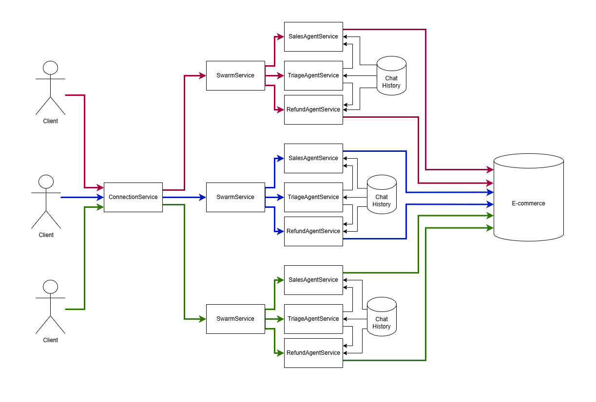

# Node Ollama Agent Swarm

> An enterprise-grade implementation of multi-agent systems using OllamaJS, featuring advanced orchestration, dynamic agent allocation, and seamless integration capabilities.

## Overview

Node Ollama Agent Swarm implements a sophisticated multi-agent architecture that enables dynamic interaction between multiple Large Language Models (LLMs). This system leverages the power of different specialized models to handle various aspects of conversation and task execution, all while maintaining context and coherence.



## Key Features

### 🔄 Dynamic Agent Orchestration
- Intelligent routing of conversations between specialized agents
- Real-time agent switching based on context and requirements
- Seamless state management across agent transitions

### 🧠 Multi-Model Intelligence
- Support for diverse LLM models (Mistral, Nemotron, etc.)
- Specialized agents for different conversation domains
- Optimized model selection based on task requirements

### 🛠 Advanced Tool Integration
- Robust function calling system
- Pluggable architecture for custom tool integration
- Registry pattern implementation for scalable tool management

### 📊 Enterprise-Ready Architecture
- Horizontally scalable microservice design
- High-performance vector similarity search
- Production-grade state management
- Built-in support for distributed systems

## Technical Architecture

### Core Components

1. **Agent Orchestration Layer**
   - WebSocket-based client session management
   - Dynamic agent allocation using clientId routing
   - Intelligent context switching mechanism

2. **Message Management System**
   - Shared chat history across agents (25-message rotation)
   - Role-specific message scoping (system/tool/user/assistant)
   - Efficient state management via Redis

3. **Tool Registry Framework**
   - Modular function registration system
   - Plugin architecture for extensibility
   - Granular access control per agent

4. **Vector Search Implementation**
   - MongoDB Community `$vectorSearch` integration
   - GPU-accelerated embedding generation
   - Optimized cosine similarity calculations

## Enterprise Benefits

- **Reduced Operational Complexity**: Streamlined management of multiple AI models
- **Enhanced Scalability**: Microservice-ready architecture for horizontal scaling
- **Improved Maintenance**: Modular design enables easier updates and modifications
- **Better Performance**: Optimized resource utilization through intelligent routing
- **Future-Proof Design**: Extensible architecture supporting new models and tools

## Technical Stack

- **LLM Models**: 
  - NVidia Nemotron-mini (Conversation)
  - IBM Granite-embedding (Vector Indexing)
- **Infrastructure**: 
  - MongoDB (Vector Storage)
  - Redis (State Management)
  - WebSocket (Real-time Communication)
- **Development Tools**:
  - TTS Synthesis
  - Speech Recognition
  - REPL Interface
  - Console Chat Interface
  - Comprehensive Test Suite

## Getting Started

### Prerequisites
```bash
# Install required models
ollama pull nemotron-mini:4b
ollama pull granite-embedding:278m
```

### Installation
```bash
# Clone repository and setup environment
cp .env.example .env

# Start required services
cd docker/mongodb && docker-compose up -d
cd docker/redis && docker-compose up -d

# Install dependencies and start
npm install
npm start
```

## Development Tools

- **REPL Environment**: `npm run start:repl`
- **Console Interface**: `npm run start:console`
- **Test Suite**: `npm run test`
- **Vector Indexing**: Available through REPL command `ioc.migrationPublicService.createProduct()`

## Architecture Details

The system's core functionality is implemented through several key components:

- **Entry Point**: [ConnectionPublicService.ts](src/services/public/ConnectionPublicService.ts)
- **Agent Logic**: [/src/services/logic](src/services/logic)
- **Tool Implementation**: [/src/tools](src/tools)

## Contributing

We welcome contributions! Please see our contributing guidelines for more details.

## License

This project is licensed under the MIT License - see the LICENSE file for details.

---